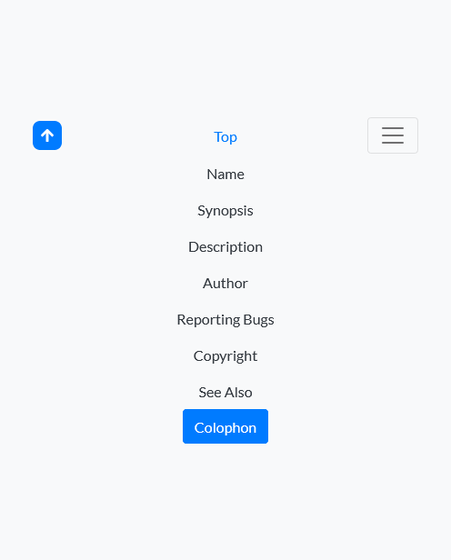
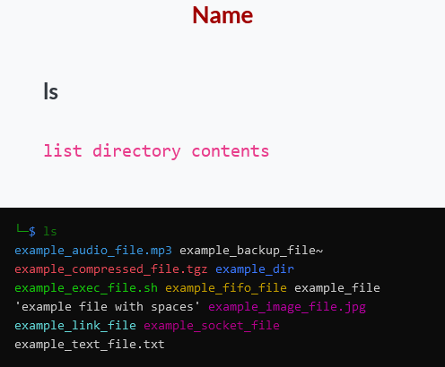
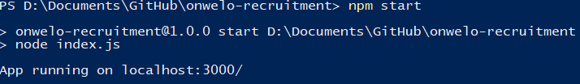

# Zadanie Rekrutacyjne Onwelo

Własna wersja strony dokumentacji https://man7.org/linux/man-pages/man1/ls.1.html  
Stworzone przez **Samuela Jędrzejewskiego**  
*samijedrzejewski@gmail.com*

## Zadanie

Stworzenie własnej wersji strony dokumentacji https://man7.org/linux/man-pages/man1/ls.1.html  
korzystając z jednego z dowolnych frameworków CSS: (n.p. https://bulma.io/, https://getbootstrap.com/docs/5.0/getting-started/introduction/)

## Opis

Zaimplementowałem autorską wersję strony manula Linuxa `ls(1)`.  
Użyłem do tego frameworka CSS Bootstrap 5 oraz JavaScriptu.


### Dane

Wszystkie dane zostały zapożyczone ze strony [manuala](https://man7.org/linux/man-pages/man1/ls.1.html), a także z wersji manuala z terminala `man ls` oraz pomocy komendy `ls --help`.


### Wygląd

Inspirację wyglądu strony czerpałem bezpośrednio z kali linuxowego terminla, to jest każdy wpis podzieliłem na dwie części. Po jednej stronie znajduje się funkcja oraz jej opis, po drugiej zaś widoczny jest terminal z przykładowym wywołaniem komendy wraz z przykładowymi plikami.


Poniżej znajduje się przykładowy kod obrazujący implementację kolorów w wirtualnym terminalu:

```html
<div class="col-lg-6 text-white showcase-img sandbox">
  <code class="terminal">
    <span class="arrow">└─</span><span class="dollar">$</span>
    <span class="cmd">ls</span> <span class="opts">-a</span><br />
    <span class="dir">.</span>
    <span class="dir">..</span>
    <span class="audio">example_audio_file.mp3</span>
    <span>example_backup_file~</span>
    <span class="compressed">example_compressed_file.tgz</span>
    <span class="dir">example_dir</span>
    <span class="exec">example_exec_file.sh</span>
    <span class="fifo">example_fifo_file</span>
    <span>example_file</span>
    <span>'example file with spaces'</span>
    <span class="dir">.example_hidden_dir</span>
    <span>.example_hidden_file</span>
    <span class="image">example_image_file.jpg</span>
    <span class="link">example_link_file</span>
    <span class="socket">example_socket_file</span>
    <span>example_text_file.txt</span>
  </code>
</div>
```

```css
.sandbox {
  --terminal-bg-clr: #0c0c0c;
  --terminal-text-clr: #ccc;
  --terminal-dir-clr: #3b78ff;
  (...)
  background-color: var(--terminal-bg-clr);
  display: flex;
  align-items: center;
}

.terminal {
  display: block;
  color: var(--terminal-text-clr);
  background-color: var(--terminal-bg-clr);
  width: 100%;
  height: max-content;
  padding: 1rem;
}
.terminal span {
  display: inline-flex;
  flex-wrap: nowrap;
}

.terminal .arrow {
  color: var(--terminal-arrow-clr);
}

.terminal .dollar {
  color: var(--terminal-dollar-clr);
}

.terminal .cmd {
  color: var(--terminal-cmd-clr);
}

.terminal .opts {
  color: var(--terminal-opts-clr);
}

.terminal .dir {
  color: var(--terminal-dir-clr);
}
(...)
```

Wszystkie style terminala znajdują się w oddzielnym pliku _CSS_ `terminal.css`.


### Linki zewnętrzne

Wszystkie linki użyte na stronie prowadzą do oryginalnych odnośników i otwierają się w nowej karcie `target="_blank"`.


### Wyszukiwanie

Podobnie jak powyżej jest w przypadku wyszukiwarki. Prosty skrypt wykonuje zapytanie w Google i otwiera je w nowej karcie.


```js
document.querySelector("[type=submit]").addEventListener("click", search);

function search(e) {
  e.preventDefault();

  const input = document.querySelector("#q");
  const url = "https://www.google.com/search";
  const params = new URLSearchParams({
    q: input.value,
    sitesearch: "man7.org/linux/man-pages",
    sa: "Search online pages",
  });

  window.open(`${url}?${params}`, "_blank").focus();
}
```

### Nawigacja

Z racji iż strona jest długa ze względu na dużą liczbę opcji komendy, dostępna jest łatwa nawigacja do poszczególnych rozdziałów.


Użytkownik może w każdej chwili powrócić na górę strony, klikając przycisk w prawym dolnym rogu ekranu.


### Responsywność

Strona oczywiście jest w pełni responsywna dzięki użyciu stylów z _Bootstrapa_ oraz `media queries`.





### Tryb ciemny

W ramach dostępności na stronie dostępna jest zmiana trybu kolorów z jasnego na ciemny i na odwrót. Ponadto skrypt wykrywa, kiedy użytkownik ma ustawioną preferencję trybu ciemnego i automatycznie zmienia kolory.


```js
const switchIcon = document.querySelector(".mode");

switchIcon.addEventListener("click", changeMode);

if (window.matchMedia("(prefers-color-scheme: dark)").matches) {
  const e = {};

  e.target = switchIcon;

  changeMode(e);
}
```

Funcja `changeMode(e)` jest również w pliku skryptowym `dark.js`.

## Uruchomienie własnej aplikacji

Dzięki _NodeJS_ jest możliwość hostowania aplikacji internetowej na własnym urządzeniu.

### Instalacja

Do uruchomienia środowiska potrzebny jest _NPM_. Aby pobrać moduły należy użyć komendy:

```bash
npm install
```

Następujące zależności zostaną pobrane:

```json
"dependencies": {
"express": "^4.17.3",
"nodejs": "0.0.0",
"open": "^8.4.0",
"path": "^0.12.7"
}
```

### Włączanie

Skrypt jest prosty do włączenia za pomocą komendy `start` poprzez _npm_. Można użyć jedną z następujących komend:

```bash
npm start
npm run start
node index.js
```



Domyślny `host` i `port` są przechowywane w stałych.

```js
const host = "localhost";
const port = 3000;
```

### Aplikacja

Aplikacja działa dzięki modułowi _expressjs_ oraz użyciu statycznej strony. Paczka `open` otwiera przeglądarkę ze wskazanym adresem.

```javascript
app.use(express.static(path.join(__dirname, "public")));
app.listen(port, host, () => {
  console.log(`App running on ${host}:${port}/`);
  open(`http://${host}:${port}`);
});
```

### Podgląd strony online

Aby przyspieszyć ogląd zadania, rozwiązanie wysłałem pliki na swój serwer, dzięki czemu można obejrzeć stronę pod adresem https://zgrajsie.com/onwelo-recruitment/
